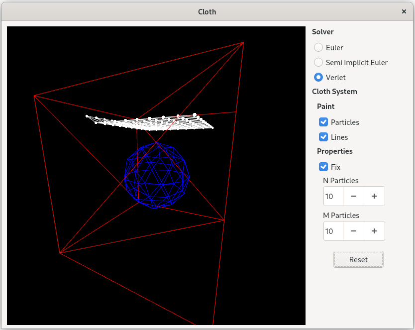
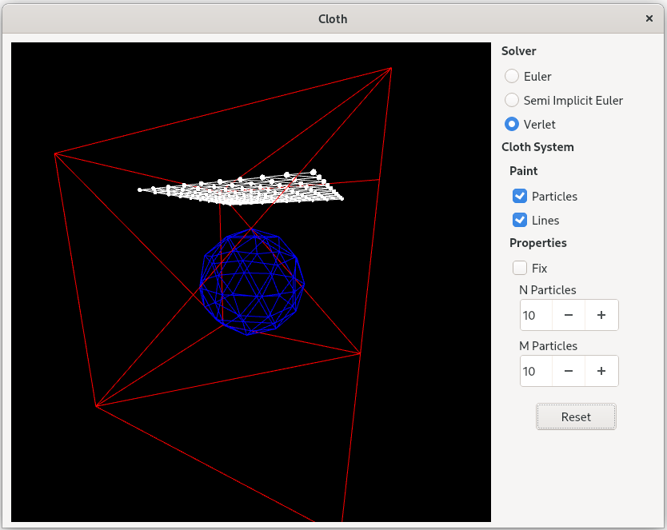

# Cloth
A simple CPU driven cloth system with an OpenGL renderer. Used Qt 5 as the base framework.

The cloth system is based on discrete particles simulation and virtual springs.

## Features
- Control the camera (`WASD` keys for movement, and `mouse left click` + `mouse movement` for orientation).
- Move the cloth anchor points (`mouse right click` + `mouse movement`)
- Numerical solvers implemented:
	- Euler
	- Semi-implicit Euler
	- Verlet
- Collider types implemented:
	- Sphere
	- Plane
	- Triangle
- Force fields implemented:
	- Gravity
	- Drag
- Implemented spring force between particles.

## Known issues
- Some particles scape the box on the edges/vertices. This is due to not checking for a collision again once the particle has been corrected. This can be easly fix at the cost of performance.

## Requirements
The software requires the following libraries to be installed:
- GLEW
- Eigen
- QT 5

## Build
Clone the repository:

	git clone https://github.com/GerardMT/Cloth
	cd Cloth

Compile the code:

    cd src
    qmake-qt5
    make

The builds can be found at `build/`.

## Run
Once build, run the project from the build directory:

	cd ../build/release/
	./cloth

## Screenshots
 

## Other
Have a look at my other physics based projects:
- [Hair](https://github.com/GerardMT/Hair)
- [Cloth](https://github.com/GerardMT/Cloth)
- [Rigid-Bodies](https://github.com/GerardMT/Rigid-Bodies)